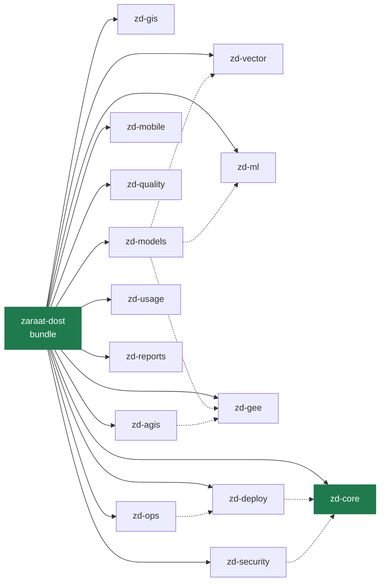

<div align="center">

<picture>
  <source media="(prefers-color-scheme: dark)" srcset="assets/logo-dark.png">
  
</picture>

# Claude Plugins for Zaraat Dost

**Agents, skills and guardrails for agricultural geospatial engineering — built for Claude Code.**

[](https://docs.claude.com/en/docs/claude-code/overview)
[](https://github.com/Adilmunawar/ZD-claude-plugin/actions/workflows/validate.yml)
[](https://github.com/Adilmunawar/ZD-claude-plugin/releases)
[](LICENSE)


One install · 14 modules · 41 commands · 12 agents · npm package · tested hooks · verified against the Claude Code CLI

[Quick start](#quick-start) · [Use cases](#use-cases) · [Modules](#modules) · [How it behaves](#how-it-behaves) · [Docs](#documentation)

</div>

---

## Why this exists

[Zaraat Dost](https://github.com/Adilmunawar) turns satellite imagery into cadastral and crop intelligence for Punjab and Sindh: a boundary-detection and land-use pipeline, a Next.js geospatial dashboard on Firebase and Earth Engine, a farmer-facing mobile app, and client deliverables. That work has hard-won rules — which CRS to compute area in, how large rasters are tiled, what a Firestore parcel document must contain, how the mobile app talks to the .NET API, what must never be committed.

This repository packages those rules as Claude Code plugins, so every engineer's session starts with the team's knowledge, the team's guardrails and the team's commands — on any machine, in any of our repositories.

## Quick start

```text
/plugin marketplace add Adilmunawar/ZD-claude-plugin
/plugin install zaraat-dost@zaraatdost
```

Then, inside a project:

```text
/zaraat-dost:doctor      environment, modules, secrets hygiene, repo standards
/zaraat-dost:setup       configure this repository for the team
/zaraat-dost:help        every command and agent, grouped by module
```

<details>
<summary><b>Shell installers, new machines, per-repository auto-install</b></summary>

Windows PowerShell:
```powershell
irm https://raw.githubusercontent.com/Adilmunawar/ZD-claude-plugin/main/install.ps1 | iex
```
macOS / Linux / WSL:
```bash
bash <(curl -fsSL https://raw.githubusercontent.com/Adilmunawar/ZD-claude-plugin/main/install.sh)
```
New machine: `/zaraat-dost:workstation` installs Git, Node, the Python GIS stack, GDAL, .NET SDK, GitHub CLI, VS Code extensions and Claude Code.
Zero-command onboarding for a repository: commit `templates/.claude/settings.json` as `.claude/settings.json`; anyone who trusts the folder gets the toolkit automatically. Details in [docs/INSTALL.md](docs/INSTALL.md).
</details>

## Use cases

Each of these is a real workflow the toolkit was built around. Prompts are shown as you would type them.

<details open>
<summary><b>1 · Take over an unfamiliar project and its database</b></summary>

```text
use the stack-analyst agent to map this repository
use the db-analyst agent to study the database and write docs/DATABASE.md
/zd-gis:study-dashboard
/zd-core:onboard
```
Result: an architecture diagram, an ER diagram with spatial columns and missing indexes, a dashboard inventory with the slowest endpoints, and a `CLAUDE.md` so the next session starts informed. All read-only until you ask for changes.
</details>

<details>
<summary><b>2 · From a model prediction to a client deliverable</b></summary>

```text
use the vector-engineer agent on predictions/boundary_mask.tif and produce a parcel layer
/zd-vector:gap-analysis parcels.gpkg aoi.gpkg
/zd-gis:export-deliverable parcels.gpkg <client>
/zd-reports:deliverable-memo deliverables/<client>
```
Result: tile-safe polygonisation, topology repair that keeps shared edges, junction straightening, road subtraction, a missing-coverage layer, a QA-checked shapefile + GeoJSON in EPSG:4326 with `area_ha`, and a one-page hand-over note.
</details>

<details>
<summary><b>3 · Run the land-use pipeline for a new season</b></summary>

```text
use the pipeline-engineer agent to run boundary inference for aoi/district.geojson
/zd-gee:ndvi-timeseries <parcel-asset> 2026-09-01 2027-04-30
/zd-gee:harvest-detect timeseries.parquet sugarcane
/zd-reports:harvest-report harvest_district_2026.gpkg docx
```
Result: chunked, resumable inference; per-parcel Sentinel-1/2 features; harvest dates with confidence; a client report with progress curves and district tables.
</details>

<details>
<summary><b>4 · Add a tool to the AGIS dashboard</b></summary>

```text
/zd-agis:new-tool sar-flood "Show Sentinel-1 flood extent for a drawn AOI"
```
Result: page, client component, Earth Engine API route and sidebar entry in the existing style, with the Firestore schema, GEE route rules and worker conventions applied automatically. `/zd-agis:audit` afterwards checks rules, secrets, payload caps and bundle size.
</details>

<details>
<summary><b>5 · Ship a mobile release without breaking the contract</b></summary>

```text
/zd-mobile:i18n-parity --fix
/zd-mobile:release-checklist production
```
Result: every string present in all four languages, RTL layout rules enforced, DTO names verified against the .NET API, bundle checked to contain only the production endpoint, versions bumped.
</details>

<details>
<summary><b>6 · Deploy, review, and keep the lights on</b></summary>

```text
/zd-deploy:preflight backend
/zd-quality:pr-description
use the security-reviewer agent on this branch
/zd-ops:runbook inference-backend
/zd-usage:report week --by project
```
Result: env vars verified by name, secrets audit clean, rollback written down before production; a PR description from the diff; ranked security findings with evidence; a runbook with verified commands; token usage by project with a weekly budget warning.
</details>

## Modules

| Module | What it covers | Docs |
|---|---|---|
| **zd-core** | Guardrail hooks, secrets audit, stack detection, onboarding, hand-over | [→](plugins/zd-core/README.md) |
| **zd-gis** | Spatial databases (PostGIS, SQL Server, GeoPackage) and dashboards, Python or .NET | [→](plugins/zd-gis/README.md) |
| **zd-vector** | Raster → parcel vectors: polygonise, repair topology, straighten, subtract roads | [→](plugins/zd-vector/README.md) |
| **zd-models** | The cadastral and land-use pipeline end to end, with its stage constants | [→](plugins/zd-models/README.md) |
| **zd-ml** | Satellite segmentation training, pre-flight bug checks, model cards | [→](plugins/zd-ml/README.md) |
| **zd-gee** | Earth Engine: auth, export limits, composites, time series, harvest detection | [→](plugins/zd-gee/README.md) |
| **zd-agis** | The Next.js / Firebase / Earth Engine dashboard and its inference backend | [→](plugins/zd-agis/README.md) |
| **zd-mobile** | The Expo farmer app: RTL i18n, API contract, secure storage, releases | [→](plugins/zd-mobile/README.md) |
| **zd-deploy** | Local vs cloud profiles: Firebase App Hosting, Vercel, HF Spaces, EAS, Docker, AWS | [→](plugins/zd-deploy/README.md) |
| **zd-quality** | Code review, conventional commits, PR descriptions, changelog, ADRs, tech debt | [→](plugins/zd-quality/README.md) |
| **zd-security** | Security review, dependency audit, repository hardening | [→](plugins/zd-security/README.md) |
| **zd-ops** | Incidents, postmortems, runbooks, observability, on-call hand-over | [→](plugins/zd-ops/README.md) |
| **zd-usage** | Usage monitoring: session ledger, reports by project/model/week, budgets, team export | [→](plugins/zd-usage/README.md) |
| **zd-reports** | Deliverable memos, harvest reports, layer metadata | [→](plugins/zd-reports/README.md) |

Every module installs on its own (`/plugin install zd-vector@zaraatdost`). Full command and agent reference, generated from the sources: [docs/COMMANDS.md](docs/COMMANDS.md).



## How it behaves

| Principle | In practice |
|---|---|
| **Detect before acting** | Agents identify the stack (Python, .NET, Next.js, Expo; PostGIS, SQL Server, Firestore, GeoPackage) and ask when unsure. |
| **Read-only where it should be** | `stack-analyst`, `db-analyst`, `geo-data-qa`, `code-reviewer`, `security-reviewer` have no write tools. |
| **Guardrails in code, not prompts** | Node hooks block destructive shell, SQL, git, EF Core, Firestore and S3 commands and refuse to write credentials. Unit-tested, dependency-free, identical on Windows, macOS and Linux. |
| **Nothing internal in this repo** | Conventions and methods only — no credentials, project ids, hostnames or client data. Enforced by a test and a self-audit in CI. |
| **Small context footprint** | About 3k tokens per session for the whole bundle; product skills load only when matching files are touched; long reports run in forked contexts. |
| **Measures itself** | A private ledger of every session; `/zd-usage:report`; weekly budgets with a session-start warning; team CSV merge. |
| **Upgrades itself** | A session-start check announces new releases; `/zaraat-dost:upgrade` updates every module and applies migration notes. |
| **Rolls out at any scale** | Per-repository settings, per-machine managed settings, or account-level pinning — [docs/GOVERNANCE.md](docs/GOVERNANCE.md). |

## Standalone tools (no Claude Code required)

The same scripts the plugins run are published as an npm package for terminals and CI:

```bash
npx @adilmunawar/zd-tools secrets-audit . --history    # CI gate: exit 1 on committed credentials
npx @adilmunawar/zd-tools usage week --by project      # Claude Code usage from local transcripts
npx @adilmunawar/zd-tools upgrade                      # update the toolkit
```

Published to GitHub Packages on every release, with the marketplace archive and SHA-256 sums attached to the [release](https://github.com/Adilmunawar/ZD-claude-plugin/releases) for offline or air-gapped installs. Package details: [packages/zd-tools](packages/zd-tools/README.md).

## Verified

Every release is exercised against the real Claude Code CLI before it is tagged — official validator on all 15 plugins, marketplace add, bundle install with dependency resolution, component inventory, hooks executed exactly as Claude Code invokes them, a simulated upgrade, 18 node tests, structure tests and a secrets audit of this repository. The log of the last run is in [docs/VERIFICATION.md](docs/VERIFICATION.md).

## Documentation

| | |
|---|---|
| [Install](docs/INSTALL.md) | one-line, per-module, per-repository, new machine, update, uninstall |
| [Commands](docs/COMMANDS.md) | generated reference of every command, agent and background skill |
| [Usage](docs/USAGE.md) | where usage is visible, keeping sessions cheap, weekly routine |
| [Governance](docs/GOVERNANCE.md) | rolling out per repo, per machine, per organisation |
| [Upgrading](docs/UPGRADING.md) | migration notes per version |
| [Architecture](docs/ARCHITECTURE.md) | module layers and design rules |
| [Troubleshooting](docs/TROUBLESHOOTING.md) | symptoms → causes → fixes |
| [Contributing](CONTRIBUTING.md) · [Security policy](SECURITY.md) · [Changelog](CHANGELOG.md) | |

## FAQ

**Does it change my repository when installed?** No. Files change only when you run `/zaraat-dost:setup`, `/zaraat-dost:standards` or `/zd-security:harden-repo`, and those show diffs first.

**Can it drop a table or delete a folder by accident?** The guard hooks block those commands and ask you to run them yourself. You can disable a hook per project with `/hooks`.

**Which model does it use?** Whatever you have selected. Validators run on Haiku to save tokens. Pin a model per agent in a fork if you need to.

**Is usage data uploaded anywhere?** No. `zd-usage` reads Claude Code's own transcript files on your machine and writes a local ledger. Team reports are CSVs you choose to share.

**Can other teams use it?** Yes — it's MIT licensed. The Earth Engine, PostGIS, vector and deploy modules are generic; the AGIS, mobile and models modules are specific to our products and are useful mainly as patterns.

## Development

```bash
bash scripts/validate.sh      # manifests, hook syntax, node + python tests, docs drift, official validator
python3 scripts/gen-docs.py   # regenerate docs/COMMANDS.md
```

Releases: bump every `plugin.json` and `packages/zd-tools/package.json` to the same version (a test enforces it), add a CHANGELOG section, tag `vX.Y.Z` (or `vX.Y`), push the tag — the workflow validates, publishes the npm package, and attaches the archive and checksums to the GitHub Release.

---

<div align="center">

Built with [Claude Code](https://docs.claude.com/en/docs/claude-code/overview) · MIT © 2026 Zaraat Dost (Pvt.) Limited

</div>
